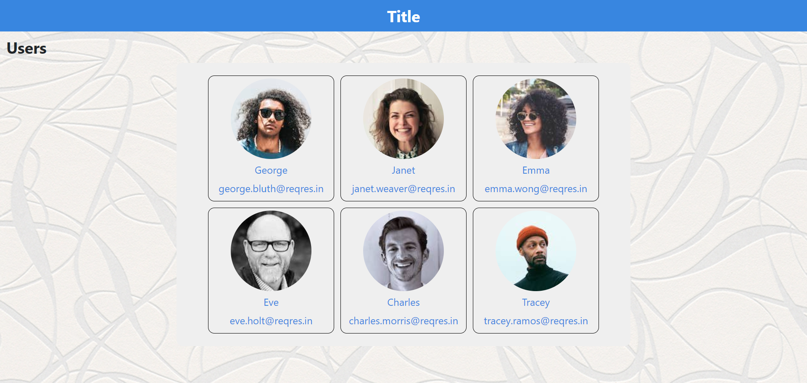
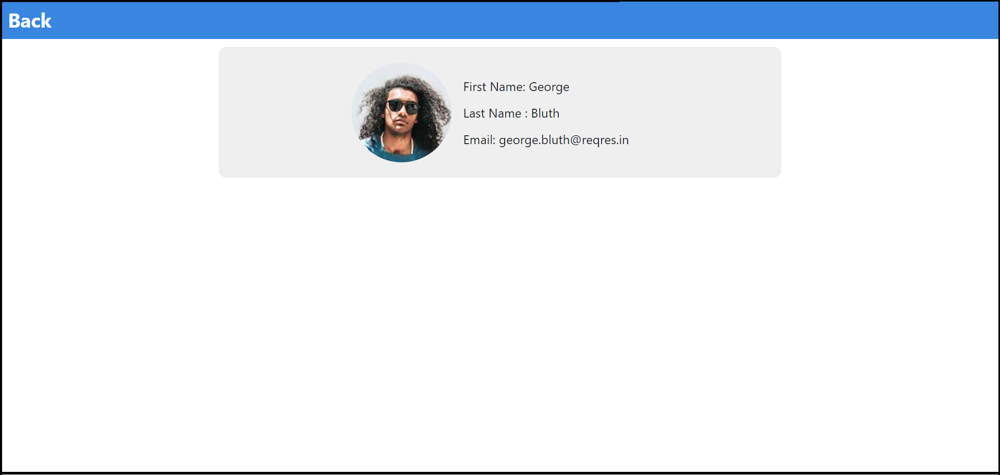

# React Development Test

### ⍟ How to start?

1. Clone/ fork the repository
2. Navigate to the clone folder
3. Run the `npm install` command
4. Run the `npm start` command

### ⍟ screenshots

 &nbsp;
 &nbsp;

  